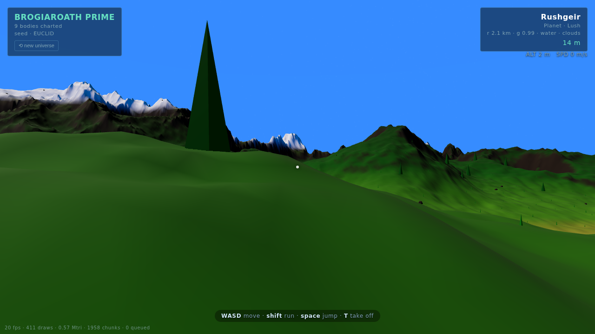

# No Man's Sky · three.js

A fully procedural universe in the browser. Infinite seeded star systems; planets of
eight archetypes (lush, oceanic, desert, frozen, volcanic, barren, toxic, exotic) with
oceans, rivers, ice caps, craters, dunes, magma seas, clouds, rings and moons — and you
can scroll from interstellar space down to the surface and **walk on any of them**.

No build step. One dependency (three.js, vendored).



## Run it

Any static file server works:

```bash
npm run dev          # → http://127.0.0.1:8000
# or: python3 -m http.server
```

Optional URL params: `?seed=ANYTHING` (a different universe), `&nolock=1` (no pointer lock).

## Controls

| input | in space | on foot |
|---|---|---|
| **scroll wheel** | fly forward/back — speed scales with altitude, so the same wheel takes you from orbit to treetop | — |
| **drag** | look around | look around (or move mouse when pointer-locked) |
| **left click** | select / fly to a planet · click a far star to **warp** to its system | — |
| **right-drag** | orbit the selected planet | — |
| **WASD** | gentle strafing | walk (**shift** run, **space** jump) |
| **L** / Land button | land when low enough | — |
| **T** | — | take off |
| **Esc** | abort fly-to | release mouse |

### Touch (phones / tablets)

| gesture | in space | on foot |
|---|---|---|
| **one-finger drag** | look around | look around |
| **pinch** | fly forward / back (the touch throttle) | — |
| **tap** | select / fly to a planet · tap a far star to warp | — |
| **two-finger drag** | orbit the selected planet | — |
| **virtual joystick** | — | walk · push to the edge to run |
| **⤊ / 🚀 buttons** | — | jump / take off |

Touch devices are auto-detected (`pointer: coarse`); the joystick appears only while
walking, render resolution is capped for mobile GPUs, and the Land button works as a tap.

## How consistency works (the interesting part)

Every planet is *defined* as two pure functions of a unit direction on its sphere,
derived from a seed:

```
height(dir, maxFreq) -> metres of terrain relief
colorAt(dir, h, slope, maxFreq) -> surface colour
```

Everything samples these same two functions:

- **Terrain LOD** (`src/quadtree.js`): a cube-sphere quadtree. Each chunk, from the
  6 root faces seen across the system down to level-9 chunks under your feet, evaluates
  `height`/`colorAt` on its grid. `maxFreq` caps noise octaves at the chunk's own sampling
  rate (first octave of each landform always survives, so mean elevation and silhouette
  never jump between LODs). A planet is literally the same function at every distance.
  LOD swaps are **geomorphed**: every chunk carries its parent-resolution shape, normals
  and colours as a relative morph target, so splits appear in the parent's exact shape
  and relax into detail (and merges animate back) — no popping terrain.
- **Walking** (`src/controls.js`): the ground under your feet is `height(dir)` —
  not a mesh raycast — so you stand exactly on the terrain you saw from orbit.
- **Liquids**: seas, ice sheets and magma are spheres at the seeded sea level; rivers are
  channels carved *below* sea level by the height function, so they flood themselves.
- **Props** (`src/scatter.js`): trees/rocks/crystals placed by hashing planet-fixed
  surface cells — leave and come back, the same rock is waiting.

Float precision at planetary scale is handled with **camera-relative rendering**: positions
live in float64 universe coordinates, the camera stays at the scene origin and the world is
repositioned around it each frame (plus a logarithmic depth buffer).

### The galaxy: every dot is a real place

The galaxy (`src/galaxy.js`) is an infinite lattice: each cell hashes to (maybe) a star;
each star's system — sun colour, planet count, types, orbits, moons, names — generates
deterministically from its coordinates. **Every star you can see in the sky is one of
these** (~15,000 in view at any time: a dense galactic disc plus a sparse halo). There is
no fake skybox; star sprites are sized to their sun's true angular diameter and parallax
correctly as you move.

That makes interstellar travel seamless in both modes:

- **Warp** (click a star twice): a real flight, not a teleport — align, spool, FOV
  stretch, hyperspace streaks, the whole sky parallaxing past, and the destination sun
  growing from a dot while its planets quietly materialize one per frame mid-flight.
- **Manual flight**: just scroll toward any dot. When you get close enough to a star,
  its system instantiates while the planets are still sub-pixel; the system behind you
  lingers until it's genuinely out of sight. The dot you watched resolves into the same
  sun you arrive at.

Scale is NMS-style compressed (suns ~5–9 km radius, planets orbiting 30–300 km out,
systems ~1,300 km apart) so that sister planets hang visibly in each other's skies and
crossing between stars is minutes, not lifetimes.

## Source map

| file | what |
|---|---|
| `src/rng.js` | seeded hashing + PRNG — the root of all determinism |
| `src/noise.js` | seeded simplex, fBm / ridged / billow / worley |
| `src/planet.js` | planet archetypes, the `height` & `colorAt` functions, palettes, water/lava/ice, atmosphere shader, clouds, rings |
| `src/quadtree.js` | chunked cube-sphere LOD with skirts, horizon culling, build budget |
| `src/galaxy.js` | universe lattice, star systems, suns, skybox, nebulae |
| `src/scatter.js` | instanced surface props by deterministic cell hash |
| `src/controls.js` | space flight + spherical-gravity first-person walking |
| `src/main.js` | state machine (space → fly-to → land → walk → take off → warp), ambience, camera-relative rendering |

## Testing (headless)

The app exposes a `window.NMS` debug API (teleport, land, warp, idle detection).
`tools/screenshot.js` drives it through real scenarios in headless Chromium
(SwiftShader WebGL) and saves screenshots:

```bash
npm install            # dev only: playwright + three for node tools
npx playwright install chromium
npm run shots          # screenshots/ — env: SEED=…, SHOTS=01,05 to filter
node tools/sanity.js   # fast node-side checks: height stats, LOD consistency, chunk builds
```
