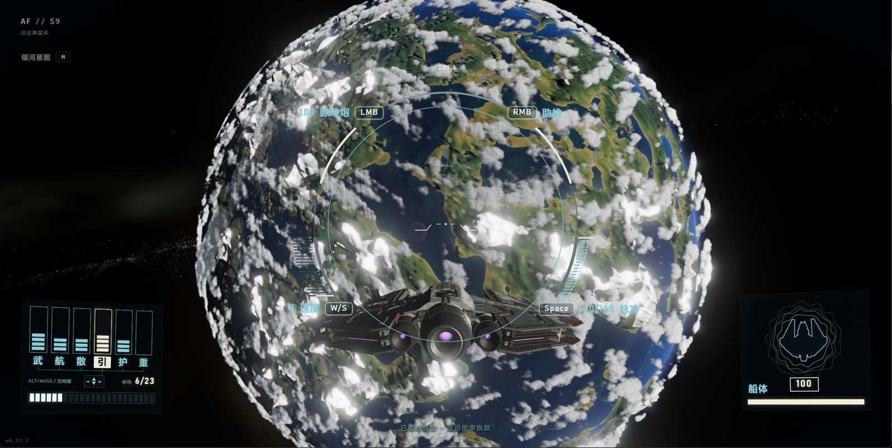

# 深空 · Deep Space

<p align="center">
  <a href="https://dp.eray.top"></a>
</p>

<p align="center">
  <a href="https://dp.eray.top"></a>
  <a href="LICENSE"></a>
  
  
  
  
  
</p>

一个完全过程化、可在浏览器中无缝探索的宇宙。从恒星际空间滚动到任意行星表面并**踏上任何一颗星球**——海洋、河流、冰盖、陨石坑、沙丘、熔岩海、云层、星环与卫星，全部由种子生成，离开再回来，同一块石头还在原地。

基于原生 ES 模块与 Three.js 构建，开发期直接运行，也能产出自包含的静态部署到 `dist/`。渲染管线使用 WebGL 2。

## 特性

- **策展银河**：一座有限、确定性的棒旋星系，共 **1,024 个可达恒星系**，按核球/棒/主臂/短臂/ spur/盘/晕分布生成。每个恒星系——太阳颜色、行星数量、类型、轨道、卫星、命名——全部由目录坐标确定性生成。天空中可见的恒星锚定在这 1,024 个目录点上，背景星点是基于目录锚点插值抖动的装饰层，无虚假 skybox。
- **八种行星原型**：繁茂、海洋、荒漠、冰封、火山、荒芜、剧毒、异相。每颗行星拥有独立的地形、调色板、液体、大气、云层、植物与地表散布。
- **无缝尺度**：状态机贯穿 太空飞行 → 飞向目标 → 着陆 → 步行 → 起飞 → 跃迁，全程无加载。滚轮从轨道到树梢，速度随高度自适应。
- **地形 LOD**：立方球面四叉树，从系统级可见的 6 个根面直到脚下第 9 级分块，全部评估同一对 `height` / `colorAt` 函数。分块切换做几何形变（geomorph），无地形跳动。
- **体积云与大气**：近距云层为真实 3D 密度场（球壳射线相交 + 光照消散），远处退化为 impostor；天空穹顶、日夜循环、日落、云影、雾气统一由同一覆盖率场驱动。
- **外星植物**：每颗行星生成自己的物种（种子化语法）——怪异树干、冠层、灌木、发光荚果、多叶片草地；近距散布气泡到 ~4.5 km 远景代理层，再到轨道级的冠层染色地形，全程无可见切换。
- **星际旅行**：跃迁（恒星跃迁，折叠航程直接抵达）与弦界航道（手动穿越边界）两种方式；真实飞行而非传送，目标恒星从光点放大为太阳，行星逐帧物化。
- **黑洞**：人马座 A\* 作为独立版本化 RNG 命名空间（`compact-objects:v1`）的目的地存在，事件视界、光子环与吸积盘在太空中可见，不重摇任何既有星系。
- **银河星图**：完整 3D 导航模式（`M` 键），暴露本地恒星网络、航线、过滤器、目标分析与确定性行星系统视图。
- **飞船与 HUD**：Asterion S-9 详细 GLB 模型，飞在前方相机视野中，转弯时倾斜、引擎随速度发光；落地后淡出。设计化舰船 HUD 含电力分配、护盾、高度、脉冲等读数。
- **地表武器与战斗 HUD**：步行模式武器槽、弹药、准星。
- **音频**：18 首场景化配乐（详见许可证），按场景懒加载，经共享 `AudioContext` 路由。
- **跨平台输入**：桌面（鼠标 + 键盘）与触屏（拖拽、捏合、虚拟摇杆、按钮）完整可玩；移动端自动降负载。
- **画质档位**：自动 / 性能 / 均衡 / 极致，依据实际帧率而非 GPU 型号判定。

## 快速开始

```bash
npm install          # 安装 Node 工具与 Playwright
npm run dev          # → http://127.0.0.1:8000（带开发 FPS 标记）
```

任何静态文件服务器均可：`npm run dev` 会注入仅开发期可见的 FPS 读数，生产构建不含。

```bash
npm test             # 语法与版本契约检查
npm run test:terrain # 过程化地形 / LOD 检查
npm run test:gameplay# 玩法检查
npm run build        # npm test 后重建可部署的 dist/
```

发布构建始终使用策展过的 `MILKY-038` 种子与 `milky-way`（银河系，共 1,024 个恒星系）。种子覆写是仅开发期的世界实验室工具：`npm run dev` 后用 `?worldlab=1&seed=ANYTHING`；其他开发参数含 `&nolock=1`（无指针锁定）、`&galaxy=milky-way`、`&system=0,0,0&body=planet-0&sea=-420&clouds=0.55`。永久策展内容应落在 `src/world-config.js`，过程化生成器保持种子纯净。

无头截图与场景验证：

```bash
npx playwright install chromium
npm run shots        # screenshots/ — 可用 SEED=… SHOTS=01,05 过滤
node tools/sanity.js # 快速节点侧检查：高度统计、LOD 一致性、分块构建
```

## 操作

### 桌面

| 输入 | 太空中 | 步行时 |
|---|---|---|
| **滚轮** | 前进/后退——速度随高度自适应，同一滚轮从轨道到树梢 | — |
| **拖拽** | 环视 | 环视（指针锁定后移动鼠标） |
| **左键** | 选择 / 飞向行星 · 点远处恒星**跃迁**到其星系 | — |
| **右键拖** | 环绕选中行星 | — |
| **WASD** | 轻微平移 | 行走（**Shift** 奔跑，**Space** 跳跃） |
| **L** / Land 按钮 | 高度足够时着陆 | — |
| **T** | — | 起飞 |
| **M** | 打开银河星图 | 银河星图 |
| **H** | 相机模式（隐藏 HUD） | 相机模式 |
| **Esc** | 中止飞向目标 / 暂停 | 释放鼠标 / 暂停 |

飞船在太空中飞在相机正前方——转弯时倾斜，引擎随速度发光；踏上行星后淡出。

### 触屏（手机 / 平板）（适配未完成）

| 手势 | 太空中 | 步行时 |
|---|---|---|
| **单指拖** | 环视 | 环视 |
| **捏合** | 前进/后退（触屏油门） | — |
| **点按** | 选择 / 飞向行星 · 点远处恒星跃迁 | — |
| **双指拖** | 环绕选中行星 | — |
| **虚拟摇杆** | — | 行走 · 推到边缘奔跑 |
| **⤊ / 🚀 按钮** | — | 跳跃 / 起飞 |

触屏设备自动识别（`pointer: coarse`）；摇杆仅在步行时出现，移动端渲染分辨率封顶，Land 按钮以点按方式工作。

## 技术架构

### 一致性：每个行星是一对纯函数

每颗行星被定义为关于其球面上单位方向的两个纯函数（由种子派生）：

```
height(dir, maxFreq)      -> 地形起伏（米）
colorAt(dir, h, slope, maxFreq) -> 表面颜色
```

一切采样都基于同一对函数：

- **地形 LOD**（`src/quadtree.js`）：立方球面四叉树，每个分块从根面到第 9 级都在其网格上评估 `height` / `colorAt`。`maxFreq` 按分块自身采样率封顶噪声倍频（每种地貌的首倍频始终保留，故平均海拔与轮廓永不在 LOD 间跳变）。一颗行星在任何距离下字面上就是同一个函数。LOD 切换做几何形变：每个分块携带父级分辨率的形状、法线与颜色作为相对形变目标，分裂以父级精确形状出现并松弛为细节（合并亦反向动画）——无地形跳动。
- **步行**（`src/controls.js`）：脚下的地面是 `height(dir)`，而非网格射线检测，因此你精确站在轨道上看到的地形上。
- **液体**：海、冰盖、熔岩是种子化海平面处的球体；河流是 `height` 函数在海平面之下刻出的河道，故自行泛滥。
- **散布**（`src/scatter.js`）：树/岩石/晶体按行星固定表面单元格哈希放置——离开再回来，同一块岩石还在原地。

### 行星尺度浮点精度

采用**相机相对渲染**：位置存于 float64 宇宙坐标，相机停在场景原点，世界每帧围绕它重新定位（外加对数深度缓冲）。分块局部顶点原点与 float64 宇宙坐标在这些尺度下仍保持毫米精度。

### 尺度

行星半径 **30–120 km**（卫星 8–20 km），千米级区域地形；行星轨道距太阳 900–12,500 km（太阳半径 200–400 km），恒星间距约 60,000 km。大到从轨道降落并徒步穿越一颗星球有行星感，又压缩到行星际跳跃只需数分钟、跃迁数秒跨越。

## 项目结构

| 路径 | 职责 |
|---|---|
| `src/main.js` | 游戏状态机与渲染循环、相机相对渲染、氛围 |
| `src/rng.js` | 种子哈希 + PRNG——一切确定性的根 |
| `src/noise.js` | 种子化 simplex、fBm / ridged / billow / worley |
| `src/planet.js` | 行星原型、`height` & `colorAt`、调色板、水/熔岩/冰、大气、云、星环 |
| `src/quadtree.js` | 带 skirt、地平剔除、构建预算的分块立方球面 LOD |
| `src/galaxy.js` / `src/galaxy-layout.js` | 宇宙晶格、恒星系统、太阳、星空、星云 |
| `src/sysview.js` / `src/starmap.js` | 系统视图与两级银河星图 |
| `src/black-hole.js` | 厄瑞玻斯事件视界、光子环与吸积盘 |
| `src/spatial-rift.js` | 弦界航道（手动星际穿越） |
| `src/scatter.js` / `src/flora.js` / `src/farflora.js` | 地表散布与外星植物（近/远层） |
| `src/clouds.js` / `src/volumetric-pass.js` | 体积云与覆盖率场 |
| `src/controls.js` / `src/walkdial.js` | 太空飞行 + 球面重力第一人称行走、步行仪表 |
| `src/ship-hud.js` / `src/surface-weapons.js` | 舰船 HUD 与地表武器 |
| `src/music.js` / `src/audio.js` | 配乐目录与飞行音频 |
| `src/world-config.js` | 策展宇宙的身份、特殊目的地与稳定调参来源 |
| `src/renderer-runtime.js` / `src/renderer-policy.js` | WebGL 2 渲染运行时与策略 |
| `vendor/` | 浏览器版 Three.js 文件，除非有意升级依赖否则勿改 |
| `assets/` | 静态模型与音频，以 `/assets/...` 提供于 URL 根 |
| `tools/` | 开发、校验与截图脚本；文档图片在 `docs/` |
| `worlds/milky-way.lock.json` | 规范宇宙兼容性快照（见下） |

## 规范宇宙契约

发布宇宙是策展过的 `milky-way` 星系，种子 `MILKY-038`，目录固定 1,024 个恒星系。`src/world-config.js` 是其身份、特殊目的地与稳定 `galaxy ID / system ID / body ID` 调参的成文来源；`src/galaxy-layout.js` 是这 1,024 个目录系统的运行时来源（`buildGalaxyCatalog` 强制 `systemCount === 1024`）。不要用其他有限烘焙目录替换它们，也不要把存档当作世界内容。

`worlds/milky-way.lock.json` 是人类可读的兼容性快照，记录完整的母系档案、成文黑洞目的地、18 个最近星系、64 系统邻域剖面、母星地形/海/云/环哨兵、生成器版本与 SHA-256 指纹。它**不**序列化整颗行星的渲染对象、纹理或玩家状态（行星表面仍按需过程化生成）。仅在有意重新策展后用 `npm run world:lock` 重建，绝不为让失败测试通过而重建。

种子化输出与 RNG 命名空间应被当作内容 API 对待。具体而言，改动 `rng.js`、`noise.js`、`names.js`、`astronomy.js`、`planet.js`、`galaxy-layout.js`、种子后缀、概率常量或既有 RNG 抽取的数量/顺序，都可能改写被选中的宇宙。尽可能通过新的独立命名空间添加可选内容。行星调整保留在 `world-config.js`。

## 许可证

本项目代码以 **MIT License** 发布。

### 第三方与例外

- **配乐**（`assets/audio/` 下 18 首 MP3，约 117 MB）：由 **Suno AI** 生成。Suno AI 对生成内容的版权状态尚存争议，这些曲目**不**随 MIT 许可释放，仅按**非商业**用途随本项目分发。曲目目录与场景绑定见 `src/music.js`。**Fork 者注意**：自行分发或商业使用前须另行获取授权，或替换为自有 / CC0 曲目；移除 `assets/audio/` 目录后游戏仍可运行（音频加载失败被静默处理）。
- **Three.js**： vendored 于 `vendor/`，遵循其 MIT 许可。
